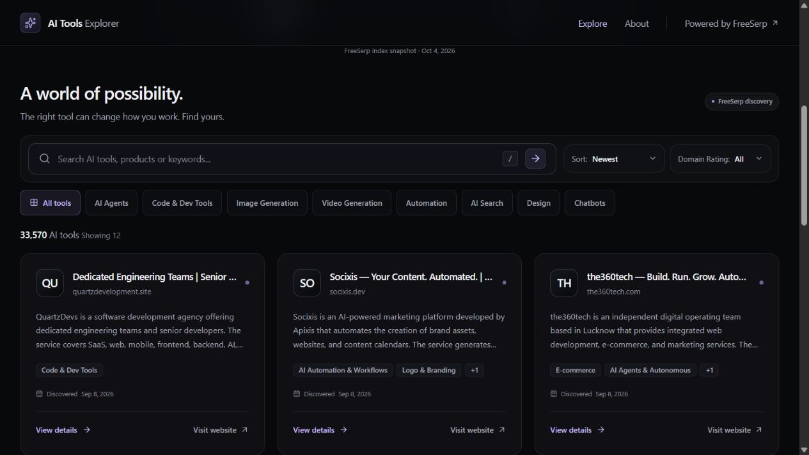

# AI Tools Explorer

A responsive catalog for discovering and evaluating AI websites and products using live FreeSerp data. Search, narrow the results, read a full tool profile, then visit its official website.

## Live Demo

Prepared for the assignment's Semalt workspace. No public deployment URL is configured in this repository. The production bundle is portable; see **Build** for hosting requirements.

## About the Project

Built for a Junior AI Web Developer test assignment, with a restrained dark interface, reusable components, and deliberately limited scope. All catalog content and statistics come from the API; missing information is omitted or clearly labeled.

## Site Plan

### Purpose

Help people discover AI products and evaluate them before leaving for an external website.

### Target Audience

Developers, designers, startup founders, product managers, marketers, and people looking for AI tools.

### Pages

1. **Explore (`/`)**: discovery catalog, search, category and Domain Rating filters, sorting, and Load More.
2. **Tool Details (`/tool/:domain`)**: full description, categories, domain information, available DR and discovery date, and an official website link.

### Structure

```text
Explore:      Header → Hero → Stats → Catalog → Footer
                                   Search / Categories / Filters / Results / Load More
Tool Details: Header → Back → Tool hero + External CTA → About + Details → Footer
```

## Preview




## Features

- Live AI niche discovery and real API totals.
- Responsive search with a 400 ms debounce; trimmed queries flow through URL state before requesting data.
- Exact API category mappings, DR thresholds of 20/40/60, and Newest/Highest DR/Most Relevant sorting.
- Shareable `q`, `category`, `sort`, and `dr` parameters; defaults are omitted and invalid values fall back safely.
- Refresh and Back/Forward restore filters. Clear filters returns to `/` without reloading.
- Twelve tools per page, appended with Load More. Changing filters starts at offset zero.
- Shareable detail pages with independent domain lookup, full summaries, and safe external links.
- Skeletons, empty results, initial-error retry, and next-page errors that preserve existing cards.
- Shared letter avatars, keyboard dropdowns, visible focus, labeled search, skip links, and CSS background animation with reduced-motion support.

## Tech Stack

React 19, TypeScript, Vite, Tailwind CSS 4, React Router, TanStack Query, Lucide React, clsx, tailwind-merge, and ESLint. No backend or authentication service is included.

## FreeSerp API

Requests are centralized in `src/api/freeserp.ts` and use the public, keyless [FreeSerp API](https://freeserp.ai/docs.php):

```text
https://freeserp.ai/api.php
index=sites&ai_startups=1&size=12&from=0&sort=went_live&order=desc
```

`index=sites` supplies homepage/site profiles. `ai_startups=1` is the API's recommended AI discovery filter. Search sends `q`; categories send the exact `ai_categories` taxonomy value; DR sends `dr_min`. Newest sorts by `went_live`, Highest DR by `dr`, and Most Relevant by `relevance` when searching (otherwise newest discovery order).

The UI uses title, domain, URL, `ai_summary`, `ai_categories`, `dr`, `went_live`, and `first_seen`. Recognized `ai_source` platform information appears selectively on details. Live responses were checked because documentation and returned category labels can differ; Chatbots maps to `AI Chatbot & Assistant`.

**Date semantics:** `went_live` records when FreeSerp first confirmed a site live; `first_seen` is the fallback discovery date. Neither guarantees an official product launch. The UI therefore says **Discovered** or **First seen live**.

Domain lookup uses `q=normalized-domain&size=1&sort=relevance`, then verifies that the returned domain matches exactly. Invalid domains make no request; absent or unrelated results produce a not-found state.

## Architecture

```text
UI components → custom hooks → TanStack Query → typed FreeSerp client
                    ↑
             React Router URL filters
```

TanStack Query owns server data, cancellation, caching, and retry. `useInfiniteQuery` owns catalog pages; `from/count/total` determines the next offset. Query keys include all request-affecting values. Previous filter pagination is discarded when filters change; cached pages remain available for five minutes during detail navigation.

Only the uncommitted search draft is local state. API requests derive from the URL, avoiding a second request path. Presentation helpers validate website URLs, format dates, and provide neutral fallbacks. Details fetch independently, so direct navigation and refresh work without card navigation state. Back preserves the catalog URL and saved scroll when available, with `/` as the direct-visit fallback.

## Project Structure

```text
public/favicon.svg
src/
├── api/                 # FreeSerp requests and response validation
├── components/          # Catalog, cards, navigation, detail UI
│   └── ui/              # Button, Badge, keyboard dropdown
├── constants/           # Filter options and API mappings
├── hooks/               # Query, URL filters, debounce
├── pages/               # ExplorePage, ToolDetailsPage
├── types/               # API and presentation models
├── utils/               # Domain/URL validation, dates, paging
├── App.tsx              # Routes
├── main.tsx             # Router and QueryClient providers
└── index.css            # Theme, focus styles, CSS animations
scripts/verify-freeserp.mjs
docs/screenshots/
prompts/
AGENTS.md
```

## AI-Assisted Development

Codex was used as a development assistant for architecture exploration, component scaffolding, API integration, UI iteration, responsive improvements, refactoring, debugging, and code review. Generated solutions were reviewed against the requirements, tested, and refined to match observed FreeSerp behavior rather than accepted unchanged. The developer retains responsibility for final review and submission.

## Development Workflow

Work was split into focused phases: foundation and development rules; UI/design system; FreeSerp integration; pagination and details; catalog URL behavior; final audit and documentation. [prompts/README.md](prompts/README.md) contains concise reconstructions of the phase instructions, not chat transcripts. [AGENTS.md](AGENTS.md) records ongoing engineering rules.

## Running Locally

Use Node.js **22.12+** (or a supported newer release) and npm.

```bash
npm ci
npm run dev
```

Open the local URL printed by Vite. No API key or environment file is needed for development. The scoped `/freeserp-api` Vite proxy needs outgoing network access.

## Build

```bash
npm run build
npm run lint
npm run test:data
npm run preview
```

Build generates standard static files in `dist/`. Preview serves that bundle locally; it is not a production server. Data tests exercise request encoding, response validation, fallbacks, URL filters, domain lookup, pagination, and next-page error/retry using controlled responses.

For the Semalt workspace, serve `dist/` and configure an SPA fallback to `index.html` for routes such as `/tool/wiley.com`. Production requests default to the public FreeSerp endpoint. If its CORS headers remain incompatible with browsers, configure an existing same-origin API proxy and build with `VITE_FREESERP_BASE_URL` pointing to it. The proxy must forward GET parameters to `https://freeserp.ai/api.php` and return a browser-compatible response. Vite's development proxy is not bundled into `dist/`; no provider-specific deployment configuration is included.

## Known Limitations

- API availability, coverage, and optional metadata depend on FreeSerp. AI discovery can include agencies or research sites; missing DR or descriptions are handled gracefully.
- During validation, FreeSerp returned duplicate `Access-Control-Allow-Origin` headers (`*, *`). Development works through the scoped Vite proxy; direct production API access requires corrected upstream CORS or a hosting-provided proxy.
- Sites paging is limited to `from + size ≤ 10,000`. Load More stops at the API window.
- Discovery dates are observations, not official launches. A tool may be absent from the index even if its website exists.

## Possible Improvements

Favorites, saved collections, comparison, and advanced filters are intentionally outside this assignment's scope.
